<h1 align="center">
 Contrato inteligente “Hello World” no Remix-IDE
</h1>

  <a href="#-tecnologias">Requisitos</a>&nbsp;&nbsp;&nbsp;|&nbsp;&nbsp;&nbsp;
  <a href="#-projeto">Projeto</a>&nbsp;&nbsp;&nbsp;|&nbsp;&nbsp;&nbsp;
  <a href="#-layout">Layout</a>&nbsp;&nbsp;&nbsp;|&nbsp;&nbsp;&nbsp;
  <a href="#-como-executar">Como executar</a>&nbsp;&nbsp;&nbsp;|&nbsp;&nbsp;&nbsp;
  <a href="#-licença">Licença</a>

  

 

## ✨ Requisitos

Para esse tutorial e necessario ter faucetes " Ether de mentira"

- [Rinkeby](https://faucet.rinkeby.io/)
- [Ganache](https://trufflesuite.com/ganache/)

## 💻 Projeto

Nesse tutorial implementaremos um contrato inteligente básico e vamos lançar a rede de teste da Rinkeby.

## 👶🏻 Passo a Passo

- Abra o [remix-ide](https://remix.ethereum.org/) no seu navegador
- Será apresentada a seguinte tela:

  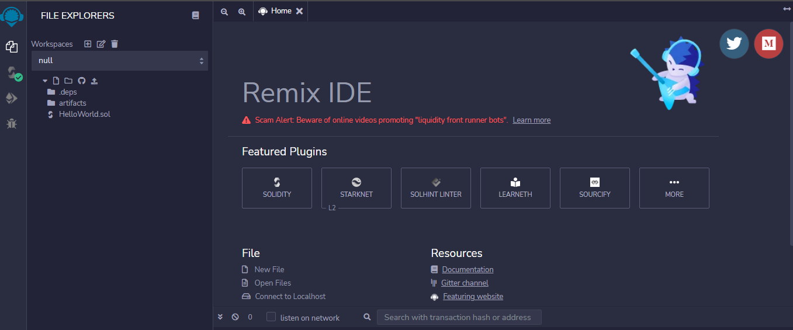

- Vamos agora em Create New File, e criar um file com o nome de  HelloWord.sol

  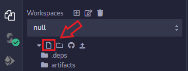

- Agora vamos clicar em HelloWorld.sol onde vamos escrever nosso primeiro codigo solidity

  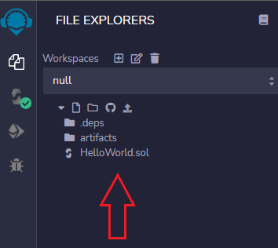

- Digite o contrato a baixo em HelloWorld.sol

  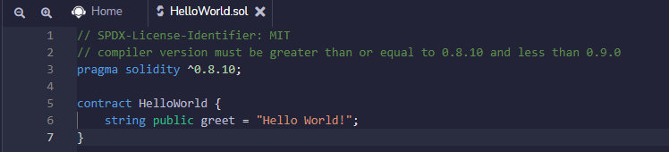

- Uma vez feito, clique no ícone logo abaixo do ícone “explorador de arquivos” conforme mostrado pela ceta em vermelho abaixo:

  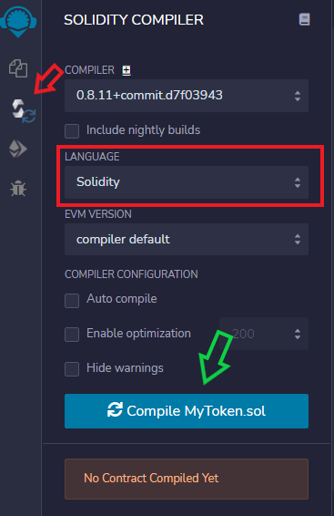

- Importante conferir a liguagem que estamos usando que é a solidity destacado de vermelho como a imagem a cima.

- Agora compile o contrato clicando no botão Compile MyToken.sol cetado pela ceta verde da imagem a cima.

- Uma vez compilado com sucesso, clique no ícone abaixo de “Solidity Compiler” que é “Implantar e executar transações” . Você será recebido pela próxima tela:

  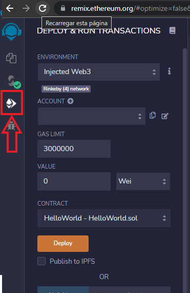

- Em seguida, clique na guia ENVIRONMENT e escolha Ambiente Web3 Injetado . Ele usará automaticamente sua conta Metamask (certifique-se de ter logado em seu Metamask primeiro).
Então Em seguida, abrirá uma solicitação da MetaMask para se conectar ao site, escolha a conta que queira se conectar (LEMBRANDO QUE PARA ESSE TUTORIAL ESTAMOS USANDO A REDE DE TESTE DA RINKEBY) 

  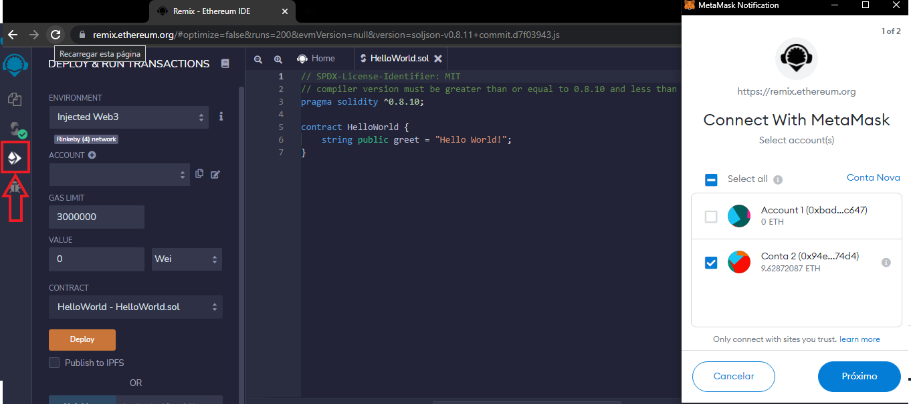

- Clique no botão “ Deploy ” Sua carteira Metamask deverá abrir automaticamente para que você possa aprovar o lançamento do seu contrato inteligente para a rede Rinkeby.

  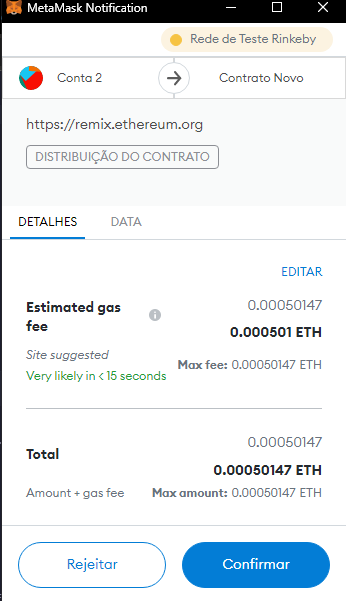

- Apos alguns segundos você vai receber uma notificação da MetaMask com o status do Deploy isso vai depender se sua internet e rápida e se a rede está sobrecarregada.

  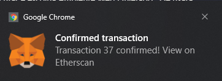

- Após a comfirmação vamos poder ver o resultado no terminal do remix e também no etherscan

  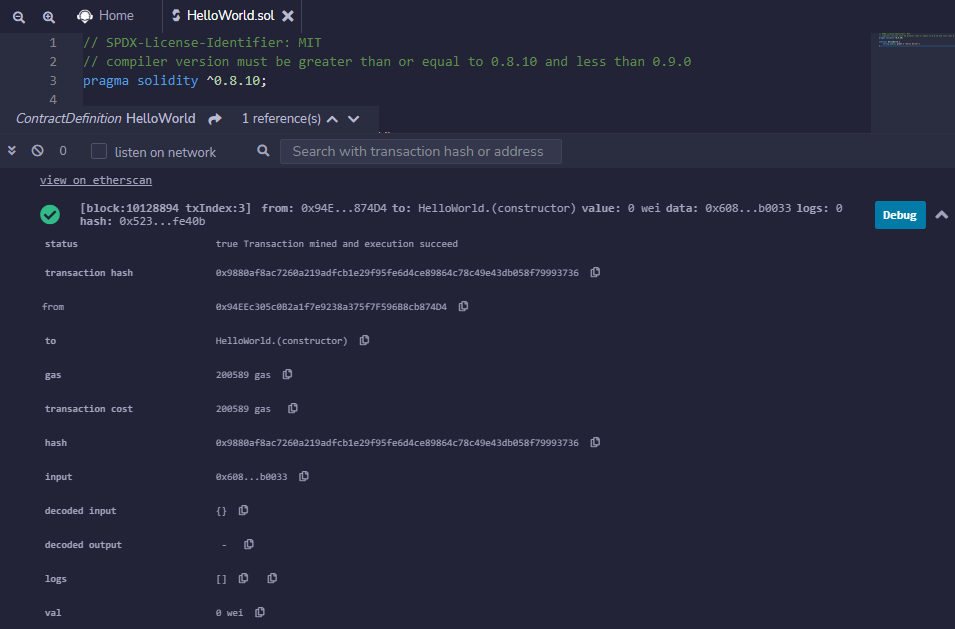

  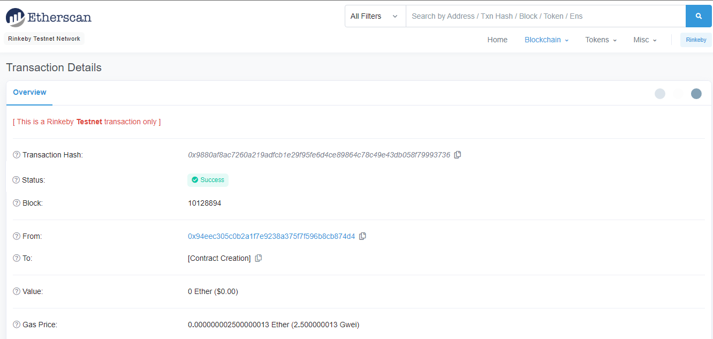

# FIM

## 📄 Licença

Esse projeto está sob a licença MIT. Veja o arquivo [LICENSE](LICENSE.md) para mais detalhes.

---
# Lembrando que o conteúdo desse repositorio e apenas para apredizagem 

